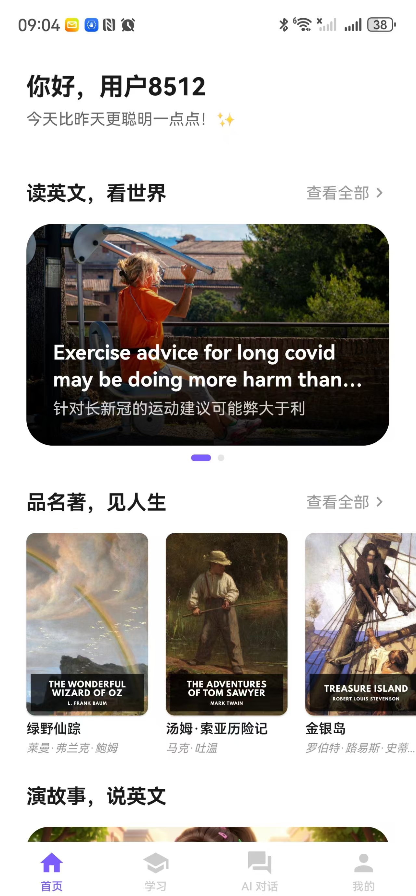
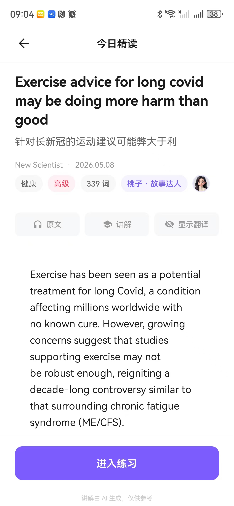
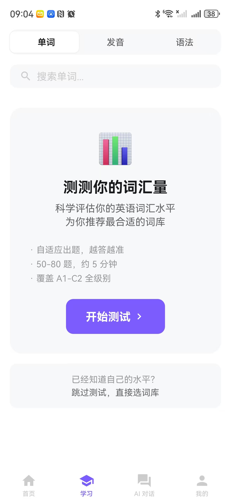
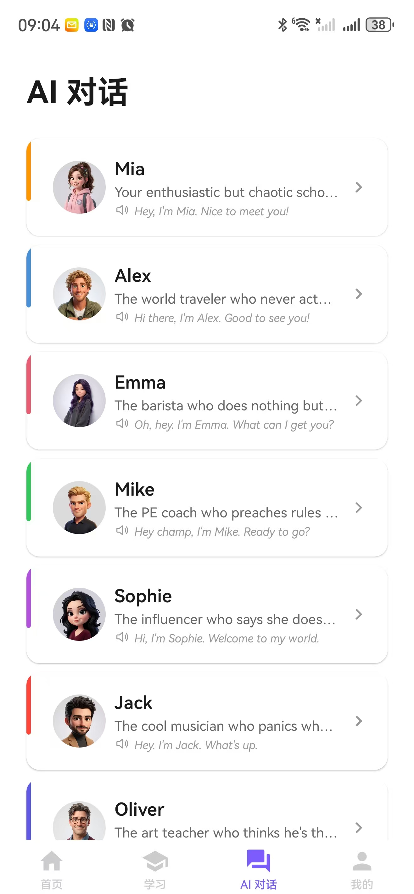
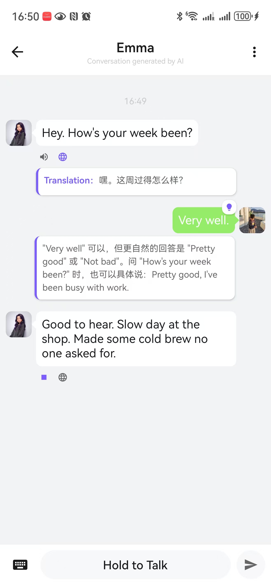
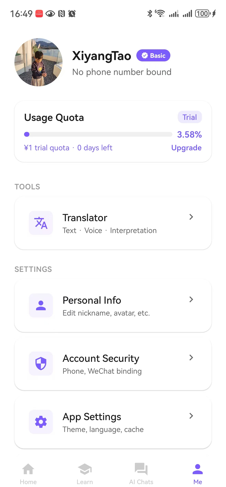
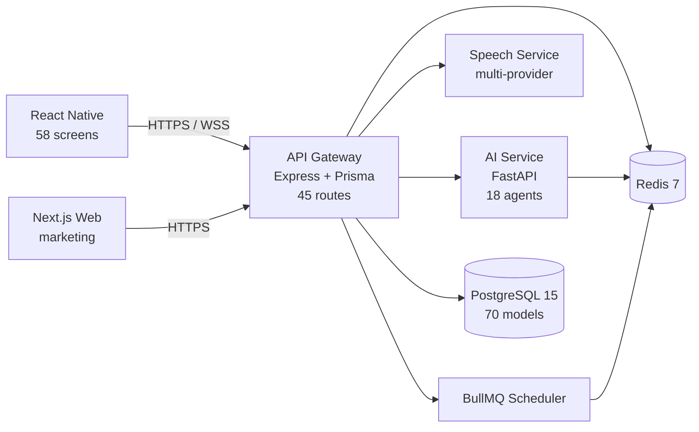

<div align="center">

# LittleGrape (小葡萄)

**A production AI English-learning app, built end-to-end by one developer — open-sourced as a learning template.**

React Native · Next.js · FastAPI · 18 LLM Agents · 70 Prisma Models · Offline-first

[](LICENSE)
[](https://reactnative.dev)
[](https://expo.dev)
[](https://www.typescriptlang.org)
[](https://python.org)
[](https://littlegrape.coderhythm.cn)

**Download the live Android app →** [littlegrape.coderhythm.cn](https://littlegrape.coderhythm.cn)

</div>

> **This repository is a learning template, not a community project.**
> The code is shared so other solo developers can study production patterns from a real, shipped app. **PRs are not accepted.** Fork freely, learn liberally.

[中文说明](#中文说明) · [What you can learn](#what-you-can-learn-from-this-repo) · [Screenshots](#screenshots) · [Architecture](#architecture) · [Local setup](#local-setup)

---

## What you can learn from this repo

This isn't a tutorial repo with toy code. It's the working source of a production app — with all its real-world decisions, edge cases, and trade-offs written into comments. If you're building something similar, these are the patterns worth studying:

| Pattern | Where to look | What you'll learn |
|---|---|---|
| **Offline-first sync (Outbox pattern)** | `apps/mobile/src/sync/` | 7 syncers + 3s push loop + server-side idempotency via client `eventId` |
| **Immutable SQLite migrations** | `apps/mobile/src/db/migrations.ts` | Append-only versioning + transactional rollback + rebuild-and-rename for missing `DROP COLUMN` |
| **18 production LLM agents** | `services/ai-service/src/services/` | Agno framework + Mem0 long-term memory + 8 persona companions |
| **Multi-provider speech routing** | `services/speech-service/src/services/` | ASR / TTS / pronunciation across Azure, OpenAI, iFlytek, Aliyun, with streaming variants |
| **Achievement engine** | `services/api-gateway/src/services/achievementService.ts` | Event-driven, 7 condition types, 4 rarity tiers, debounced counter checks |
| **Quota piggyback pattern** | `services/api-gateway/src/services/quotaService.ts` | Quota state rides existing API responses; 429 triggers a global modal |
| **JWT with queue-protected reissue** | `services/api-gateway/src/middleware/` | Prevents thundering-herd token refresh under concurrent requests |
| **Adaptive vocabulary test** | `apps/mobile/src/services/VocabTestAlgorithm.ts` | IRT-style adaptive question selection across A1–C2 levels |
| **Daily-quest system** | `services/api-gateway/src/routes/dailyChallenge.ts` | 3 lazy-generated slots + streak rewards scaling 30 → 70 XP |
| **Push hygiene** | `services/api-gateway/src/services/` | 24h same-type dedupe + daily cap + quiet-hours downgrade |
| **HTTP keep-alive tuning for mobile + LB** | `services/api-gateway/src/index.ts` (line ~64) | Why `keepAliveTimeout = 65s` — real ALB/SLB story in the comments |
| **Design-token theming + 375pt scaling** | `apps/mobile/src/theme/` | Token system + responsive helpers from iPhone SE to iPad |
| **i18next with feature-domain namespacing** | `apps/mobile/src/locales/` | Scaling i18n past 1000 keys without losing your mind |

---

## Screenshots

<table>
  <tr>
    <td align="center" width="33%">
      <br />
      <sub><b>Home</b><br/>Daily reading + classics shelf</sub>
    </td>
    <td align="center" width="33%">
      <br />
      <sub><b>Daily Reading</b><br/>Bilingual article + AI explanation</sub>
    </td>
    <td align="center" width="33%">
      <br />
      <sub><b>Adaptive Vocab Test</b><br/>50–80 questions · A1–C2</sub>
    </td>
  </tr>
  <tr>
    <td align="center" width="33%">
      <br />
      <sub><b>AI Companions</b><br/>8 personas, distinct voices</sub>
    </td>
    <td align="center" width="33%">
      <br />
      <sub><b>Live Chat</b><br/>Translation + smart correction tips</sub>
    </td>
    <td align="center" width="33%">
      <br />
      <sub><b>Profile</b><br/>Quota · tools · settings (English UI)</sub>
    </td>
  </tr>
</table>

---

## Architecture



---

## What's in the box

```
apps/
  mobile/          React Native 0.81 (Expo 54), TypeScript 5.9, 58 screens
  web/             Next.js 16 (App Router, static export) — marketing + privacy/terms
services/
  api-gateway/     Express 5 + Prisma — public API surface (45 route files)
  ai-service/      Python 3.12 + FastAPI — 18 LLM agents (Agno + Mem0)
  speech-service/  Express 5 — multi-provider ASR / TTS / pronunciation
packages/
  database/        Prisma schema (70 models) + migrations
  date-utils/      Shared date helpers
  shared/          Cross-package types & static config
scripts/
  classics/        Reading pipeline (EPUB → graded chapters → quiz)
  story/           Story-mode generation (script + quiz + audio)
  word-processor/  Dictionary parsing, frequency, sense validation
  research/        BBC / VOA corpus extraction
```

### By the numbers
- 58 screens · 21 services · 12 Zustand stores (mobile)
- 11 SQLite tables · 7 offline-first syncers
- 45 API routes · 70 Prisma models · 18 LLM agents
- ~165,000 lines of production code (TypeScript + Python)
- Bilingual (zh-CN / en) via i18next, feature-domain key namespacing

---

## Tech stack

| Layer | Stack |
|---|---|
| Mobile | React Native 0.81, Expo 54, TypeScript 5.9, Zustand, TanStack Query, Reanimated |
| Mobile DB | `op-sqlite` + custom immutable migration runner |
| Web | Next.js 16, App Router, static export |
| API Gateway | Node.js 20, Express 5, Prisma, JWT (access + refresh + queue-protected reissue) |
| AI Service | Python 3.12, FastAPI, Agno agent framework, Mem0 long-term memory |
| Speech Service | Node.js, Express 5, multi-provider ASR/TTS (Azure / OpenAI / iFlytek / Aliyun) |
| Realtime | WebSocket channel for achievements & assistant nudges |
| Background jobs | BullMQ scheduler in-process in the gateway |
| Database | PostgreSQL 15, Prisma ORM, append-only migrations |
| Cache / Queue | Redis 7 |
| Tooling | Yarn 4 Workspaces, Jest, pytest, ESLint, Prettier, Black, isort |

---

## Engineering deep-dive

A few decisions worth pointing at:

- **Offline-first sync.** Every write hits local SQLite first; an Outbox processor polls every ~3s and pushes to the server. Each syncer carries its own priority and conflict policy. Idempotency is enforced server-side via client-generated `eventId`s.
- **Immutable mobile DB migrations.** Schema bumps are append-only and run in a transaction. SQLite's lack of `DROP COLUMN` is handled with a rebuild-and-rename helper.
- **18 LLM agents** under `services/ai-service/src/services/` — companion (with Mem0 long-term memory), tips, score, evaluation, grammar, reading, sentence/word explanation, word practice + reviewer, translation, notes, exercise, English coach, learn assistant.
- **Achievement engine** — event-driven, debounced count checks (every-50 strategy for high-frequency counters), 7 condition types, 4 rarity tiers, real-time WS push.
- **Daily-quest system** — 3 lazy-generated slots (vocabulary / listening / reading-writing), streak rewards scaling 30 → 70 XP.
- **Quota piggyback** — quota state rides existing API responses to avoid extra round-trips; a 429 triggers a global modal via a Zustand store.
- **Push hygiene** — 24h same-type dedupe, daily cap, quiet-hours downgrade.
- **Multi-provider speech** — ASR / TTS / pronunciation routing across Azure, OpenAI, iFlytek, Aliyun, with streaming variants.

---

## Local setup

```bash
# 1. Install dependencies
yarn install

# 2. Copy env templates and fill in real values
cp .env.example .env                              # backend services (gateway/ai/speech)
cp apps/mobile/.env.example apps/mobile/.env      # mobile app
# Optional: ai-service has a narrower template if you only want to run it standalone
# cp services/ai-service/.env.example services/ai-service/.env

# 3. Start infrastructure
yarn dev:infrastructure         # Postgres + Redis via docker-compose

# 4. Run a service in dev mode
yarn gateway:dev                # API gateway   :3000
yarn ai:dev                     # AI service    :3001
yarn speech:dev                 # Speech        :3003
yarn web:dev                    # Marketing web :3000 (uses :4000 if PORT set)
yarn mobile:dev                 # Expo dev server
```

Or the whole backend in Docker:

```bash
yarn docker:up
```

---

## Status

- **Android**: shipped, on production — **download from the official site:** [littlegrape.coderhythm.cn](https://littlegrape.coderhythm.cn)
- **iOS**: build in progress
- **Repo**: learning-template snapshot — tracks the live codebase, not actively maintained as an open-source project

## Why no PRs?

This repo is a **learning template**, not a community-maintained project. The code reflects one developer's decisions in a real production app; merging external contributions would dilute that perspective and commit me to maintenance I can't sustain.

**What you can do instead:**
- Fork it and build your own version — that's the entire point
- Open a GitHub Discussion if you want to ask about a specific design decision
- Report security issues via GitHub Security Advisories (private), not public Issues

---

## Acknowledgments

Built on the shoulders of:
- [Expo](https://expo.dev) — React Native tooling that actually works
- [Agno](https://agno.com) — the agent framework powering 18 production LLM agents
- [Mem0](https://mem0.ai) — long-term memory for the AI companion
- [op-sqlite](https://github.com/OP-Engineering/op-sqlite) — fast SQLite for React Native
- [Prisma](https://prisma.io) — typed ORM keeping 70 models sane

## License

[MIT](LICENSE)

---

<a id="中文说明"></a>

## 中文说明

LittleGrape（小葡萄）是我作为独立开发者从 0 到 1 设计、开发并上线的 AI 英语学习 App。本仓库作为**学习模板**对外公开——给同样在做产品的独立开发者作参考。**不接受外部 PR**，你可以自由 fork、自由学习。

### 你能从这个仓库学到什么

这不是教学项目，而是一个真实生产环境 App 的工作源码——所有设计决策、边界场景、取舍都写在代码注释里。如果你也在做类似的产品，这些工程模式值得逐个研究：

| 工程模式 | 在哪里看 | 学到什么 |
|---|---|---|
| **离线优先同步（Outbox 模式）** | `apps/mobile/src/sync/` | 7 个 Syncer + 3s 推送循环 + 服务端 `eventId` 幂等 |
| **不可变 SQLite 迁移** | `apps/mobile/src/db/migrations.ts` | 追加式版本 + 事务回滚 + SQLite 无 `DROP COLUMN` 的重建方案 |
| **18 个生产 LLM Agent** | `services/ai-service/src/services/` | Agno 框架 + Mem0 长期记忆 + 8 个 persona 陪伴角色 |
| **多 provider 语音路由** | `services/speech-service/src/services/` | Azure / OpenAI / 讯飞 / 阿里云的 ASR / TTS / 发音评估，含流式 |
| **成就引擎** | `services/api-gateway/src/services/achievementService.ts` | 事件驱动 + 7 种条件 + 4 个稀有度 + 高频计数器防抖 |
| **配额 piggyback 模式** | `services/api-gateway/src/services/quotaService.ts` | 配额状态搭车 API 响应避免额外往返；429 触发全局降级 |
| **JWT 队列保护重发** | `services/api-gateway/src/middleware/` | 并发请求下避免雷霆 token 刷新 |
| **自适应词汇测试** | `apps/mobile/src/services/VocabTestAlgorithm.ts` | IRT 风格的自适应出题，覆盖 A1–C2 |
| **每日任务系统** | `services/api-gateway/src/routes/dailyChallenge.ts` | 3 个懒生成槽位 + 连续打卡奖励 30→70 XP |
| **推送防打扰** | `services/api-gateway/src/services/` | 24h 同类去重 + 每日上限 + 安静时段降级 |
| **移动端 + LB 的 keep-alive 调优** | `services/api-gateway/src/index.ts`（约 64 行） | `keepAliveTimeout = 65s` 的真实 ALB/SLB 踩坑故事在注释里 |
| **Design Token 主题 + 375pt 缩放** | `apps/mobile/src/theme/` | 适配从 iPhone SE 到 iPad 的响应式工具 |
| **i18next 功能域命名** | `apps/mobile/src/locales/` | 1000+ key 后仍保持清晰的双语方案 |

### 工程亮点

详见上方英文版 [Engineering deep-dive](#engineering-deep-dive)。核心包括：

- 离线优先 Outbox 同步 + `eventId` 幂等
- 多邻国式成就系统 / 每日任务 / 连续打卡奖励
- 配额 piggyback + 429 全局降级
- 推送防打扰（24h 同类去重 + 每日上限 + 安静时段降级）
- 完整 design token 主题系统 + 375pt 响应式缩放
- i18next 双语 + 功能域 key 命名

### 状态

- **Android**：已上线，**官网下载入口**：[littlegrape.coderhythm.cn](https://littlegrape.coderhythm.cn)
- **iOS**：构建中
- **仓库**：作为学习模板对外公开，**不接受外部 PR**

### 为什么不接受 PR？

这个仓库定位是**学习模板**，不是社区维护项目。代码反映的是一个独立开发者在真实生产环境里的决策；合并外部贡献会稀释这种视角，也会让我承担无法持续的维护负担。

**你可以做的事**：
- Fork 出去做自己的版本——这就是开源的本意
- 想了解某个设计决策可在 GitHub Discussions 提问
- 安全问题请通过 GitHub Security Advisories（私密）汇报，不要开公开 Issue
